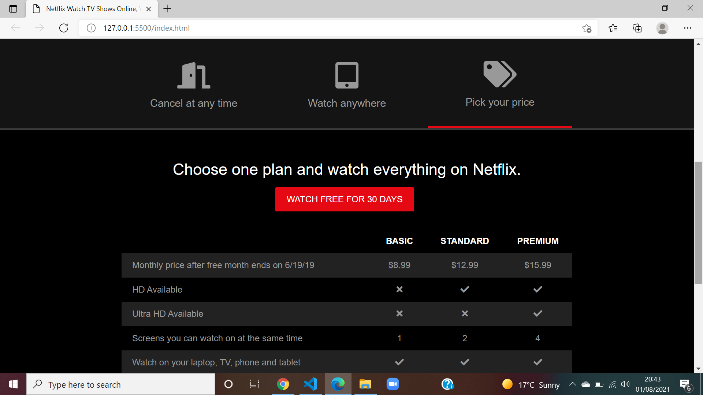

# netflix-landing-page
# Description
 I have re-created the Netflix landing page using HTML, CSS and a bit of JavaScript for the tabs. I used modern CSS3+ techniques like Grid, Flex, overlays, shadows, etc

 # Links
 Application repository: https://github.com/Mahmoudcali02/netflix-landing-page
 
 Deployed application: https://mahmoudcali02.github.io/netflix-landing-page/#index.html

 # Screenshots

# Referrences 
Font Awesome: https://fontawesome.com/

Traversy Media: https://www.youtube.com/channel/UC29ju8bIPH5as8OGnQzwJyA

